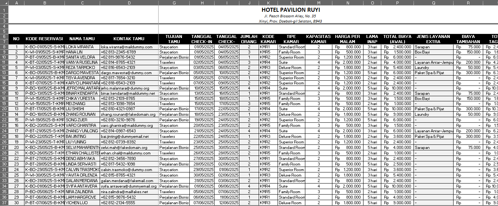

# Hotel Reservation & Revenue Management System (Excel Portfolio)

## 📌 Project Overview
This repository contains a comprehensive Excel-based data management system designed for a hospitality business model (**"Hotel Pavilion Ruyi"**). The project automates the entire guest lifecycle, from decoding reservation strings and calculating precise stay durations to tracking real-time arrival statuses and room revenue distributions using advanced programmatic formulas.

## 🗂️ Relational Data & Room Master Tables
The architecture utilizes a dedicated reference table to enforce data consistency across all guest transactions. Data mapping is dynamically executed based on:
*   **Room Master Reference:** Centralizes critical properties such as *Room Code (Kode Kamar)*, *Room Type (Tipe Kamar)*, *Maximum Occupancy (Kapasitas Kamar)*, and *Base Room Rate (Harga Per Malam)*.
*   **Guest Logs:** Manages reservation dates, identity types (KTP/Paspor), contact points, and auxiliary service add-ons (e.g., Spa packages, baby cots, or airport transfers).

## 🛠️ Excel Formulas & Techniques Demonstrated
The automation layer uses advanced lookup arrays, time intelligence, and nested conditional constraints to handle data processing without human intervention:

*   **Robust Multi-Criteria Lookups (`INDEX` + `MATCH`):** Deployed a dynamic `INDEX` and `MATCH` matrix instead of restrictive lookup alternatives to automatically scan room codes and populate *Room Type*, *Max Capacity*, and *Base Room Rate (Harga per Malam)* dynamically.
*   **Text Parsing & Substring Lookups (Nested `IF` + `MID`):** Decodes raw, custom-formatted reservation tokens (e.g., `K-BO-01/05/25-S-KMR1`) to systematically identify operational attributes:
    *   **Booking Channels (Jenis Pemesanan):** Automatically flags entries as *Booking Online*, *Walk-in*, or *Booking via Telepon*.
    *   **Guest Purposes (Tujuan Tamu):** Instantly categorizes travel intent into *Staycation*, *Perjalanan Bisnis*, or *Travelers*.
*   **Time Intelligence & Date Formatting (`DATEVALUE` & Text Functions):** Sanitizes raw reservation text into standardized date objects (`YYYY-MM-DD`). This enables precise date math to evaluate *Length of Stay (Lama Inap)* and calculate the *Initial Total Cost (Total Biaya Awal)*.
*   **Real-Time Status Tracking (Nested `IF` + `TODAY`):** Implemented time-sensitive logical branches utilizing the `TODAY()` function to dynamically determine real-time *Arrival Status (Status Kedatangan)* (e.g., checking if the checkout threshold has passed relative to the current live clock context).

## 📋 Reservation Database Log Preview
*Below is a visual snapshot of the fully automated hotel reservation system processing live guest attributes:*

## 📁 Repository Structure
*   `Hotel Reservation Management System.xlsx` - The dynamic workbook containing database logs, master records, and automation formulas.
*   `README.md` - Complete portfolio documentation.

## 🚀 How to Use This Project
1. Clone or download this repository.
2. Open `Hotel Reservation Management System.xlsx` using Microsoft Excel (2019 or newer recommended).
3. Inspect the automated columns to explore the syntax construction of the nested `INDEX-MATCH` and `MID` conditional algorithms.

## 💬 Let's Connect! 
I am actively seeking Data Analyst opportunities where I can bridge the gap between complex data pipelines and corporate strategy.

LinkedIn: https://linkedin.com/in/aulia-khairunnisa
Email: aulkhairn@gmail.com
