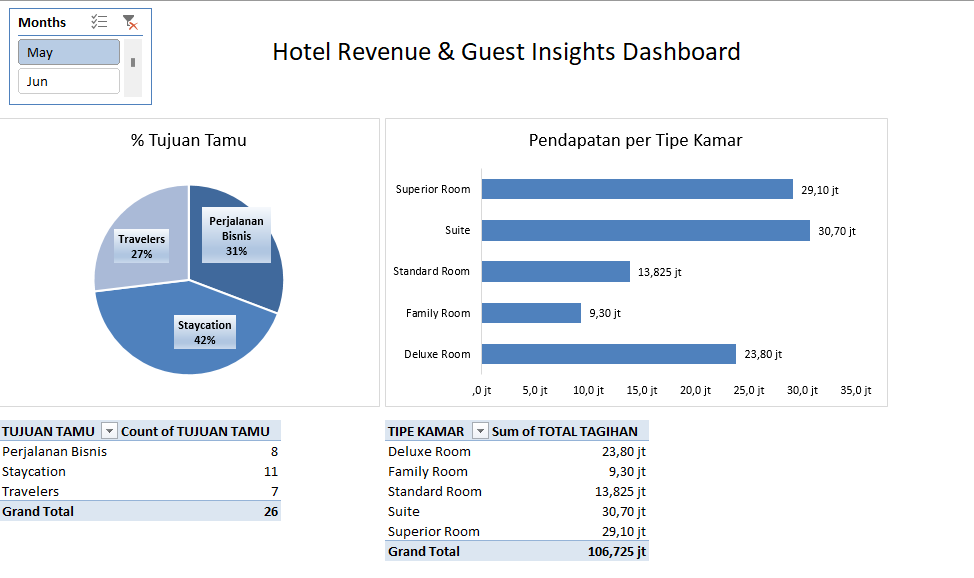

# Hotel Reservation & Revenue Management System

## 📌 Project Overview
An automated Excel-based data management system for **Hotel Pavilion Ruyi**. This project automates the entire guest lifecycle from parsing raw reservation strings to tracking real-time arrival statuses using advanced programmatic formulas and built an interactive dashboard about room revenue distributions.

## 🛠️ Key Features & Excel Techniques
* **Multi-Criteria Lookups (`INDEX` + `MATCH`):** Dynamically maps *Room Type*, *Max Capacity*, and *Base Rate* from the Room Master table.
* **Text Parsing (`MID` + Nested `IF`):** Decodes raw reservation tokens (e.g., *K-BO-01/05/25-S-KMR1*) to automatically categorize:
  * **Booking Channels:** *Booking Online*, *Walk-in*, or *Booking via Telepon*.
  * **Guest Purposes:** *Staycation*, *Perjalanan Bisnis*, or *Travelers*.
* **Time Intelligence (`DATEVALUE` & Date Math):** Converts raw text into standardized date objects (`YYYY-MM-DD`) to calculate exact *Length of Stay* and *Initial Total Cost*.
* **Real-Time Status Tracking (`IF` + `TODAY()`):** Dynamically updates *Arrival Status* based on the current live clock context.

## 📋 Dashboard & Logs Preview
### Reservation Database Log

### Interactive Dashboard

## 📁 Repository Structure
* `Hotel Reservation Management System.xlsx` – Dynamic workbook with database logs, master records, and formulas.
* `README.md` – Project documentation.

## 🚀 How to Use
1. Download or clone this repository.
2. Open the `.xlsx` file using **Microsoft Excel (2019 or newer)**.
3. Test the interactive Monthly Slicers on the dashboard tab to witness real-time reporting updates.

## 💬 Let's Connect!
I am actively seeking **Data Analyst** opportunities.
* **LinkedIn:** [linkedin.com/in/aulia-khairunnisa](https://linkedin.com/in/aulia-khairunnisa)
* **Email:** aulkhairn@gmail.com
